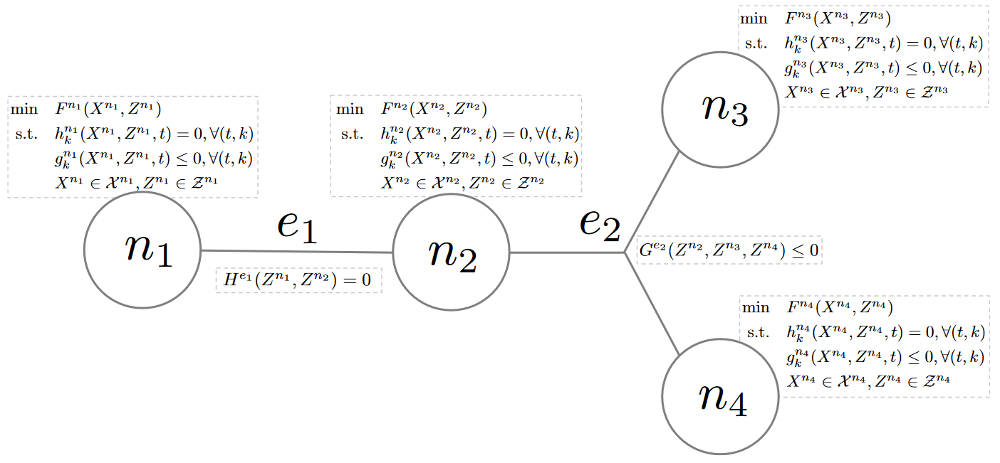

Abstract GBOML problem
======================

The modeling language is particularly well-suited for representing problems involving the optimization of discrete-time dynamical systems over a finite time horizon and exhibiting a natural block structure that may be encoded by a hierarchical hypergraph. A hypergraph abstraction is therefore employed to represent them. Nodes can therefore be viewed as hierarchical hypergraphs themselves representing optimization subproblems, while hyperedges express the relationships between nodes. A global discretized time horizon and associated set of time periods common to all nodes are also defined. Each node is equipped with a set of so-called *internal* and *external* (or *coupling*) variables. A set of constraints may be also defined for each node, along with a local objective function representing its contribution to a system-wide objective. Finally, for each hyperedge, constraints involving the coupling variables of the nodes to which it is incident are defined in order to express the relationships between nodes. In the following paragraphs, we formally define variables, constraints, objectives and formulate the abstract model that encapsulates the class of problems considered. For the sake of clarity, we do so for a model that can be represented by a hypergraph with a single *layer* (i.e., there is one level in the hierarchy).

Let :math:`\mathcal{G} = (\mathcal{N}, \mathcal{E})` be a (possibly directed) hypergraph encoding the block structure of the problem at hand, with node set :math:`\mathcal{N}` and hyperedge set :math:`\mathcal{E} \subseteq 2^\mathcal{N}` (i.e., each hyperedge corresponds to a subset of nodes), let :math:`T` be the time horizon considered and let :math:`\mathcal{T} = \{0, 1, \dots, T - 1\}` be the associated set of time periods. Let :math:`X^n \in \mathcal{X}^n` and :math:`Z^n \in \mathcal{Z}^n` denote the collection of internal and coupling variables defined at node :math:`n \in \mathcal{N}`. Note that variables may take values in discrete or continuous sets. In addition, for any hyperedge :math:`e \in \mathcal{E}`, let :math:`Z^e = \{Z^n | n \in e\}` denote the collection of coupling variables associated with each node to which this hyperedge is incident.

Let :math:`F^n` denote the function defining the local objective at node :math:`n \in \mathcal{N}`. In this paper, we consider scalar objectives of the form

.. math::

  F^n(X^n, Z^n) = f_0^n(X^n, Z^n) + \sum_{t \in \mathcal{T}} f^n(X^n, Z^n, t),

where :math:`f_0^n` and :math:`f^n` are (scalar) affine functions of :math:`X^n` and :math:`Z^n`.

Both equality and inequality constraints may be defined at each node :math:`n \in \mathcal{N}`. More precisely, an arbitrary number of constraints that can each be expanded over a subset of time periods may be defined. Hence, we consider equality constraints of the form

.. math::

  h_k^n(X^n, Z^n, t) = 0, \mbox{ } \forall t \in \mathcal{T}_k^n

with (scalar) affine functions :math:`h_k^n` and index sets :math:`\mathcal{T}_k^n \subseteq \mathcal{T}`, :math:`k = 1, \ldots, K^n`, as well as inequality constraints

.. math::

  g_k^n(X^n, Z^n, t) \le 0, \mbox{ } \forall t \in \bar{\mathcal{T}}_k^n,

with (scalar) affine functions :math:`g_k^n` and index sets :math:`\bar{\mathcal{T}}_k^n \subseteq \mathcal{T}`, :math:`k = 1, \ldots, \bar{K}^n`.

Likewise, both equality and inequality constraints may be defined over any hyperedge :math:`e \in \mathcal{E}`. These constraints, however, can only involve the coupling variables of the nodes to which hyperedge :math:`e \in \mathcal{E}` is incident (i.e., nodes such that :math:`n \in e`). More precisely, let :math:`H^e` and :math:`G^e` be affine functions of :math:`Z^e` used to define the equality and inequality constraints associated with a given hyperedge :math:`e\in\mathcal{E}`.

Using this notation, the class of problems that can be represented in this framework reads

.. math::

  \begin{array}{rl}
  \min & \sum_{n \in \mathcal{N}} F^n(X^n, Z^n) \\
  \hbox{s.t.} & h_k^n(X^n, Z^n, t) = 0, \mbox{ } \forall t \in \mathcal{T}_k^n, \hspace{2pt} k = 1, \ldots K^n, \hspace{2pt} \forall n \in \mathcal{N} \\
  & g_k^n(X^n, Z^n, t) \le 0, \mbox{ } \forall t \in \bar{\mathcal{T}}_k^n, \hspace{2pt} k = 1, \ldots \bar{K}^n, \hspace{2pt} \forall n \in \mathcal{N} \\
  & H^e(Z^e) = 0, \hspace{2pt} \forall e \in \mathcal{E} \\
  & G^e(Z^e) \le 0, \hspace{2pt} \forall e \in \mathcal{E} \\
  & X^n \in \mathcal{X}^n, Z^n \in \mathcal{Z}^n, \hspace{2pt} \forall n \in \mathcal{N}.
  \end{array}

:numref:`abstract_problem` schematically illustrates the class of problems that can be modelled in this framework.

  Schematic representation of the abstract GBOML problem.
