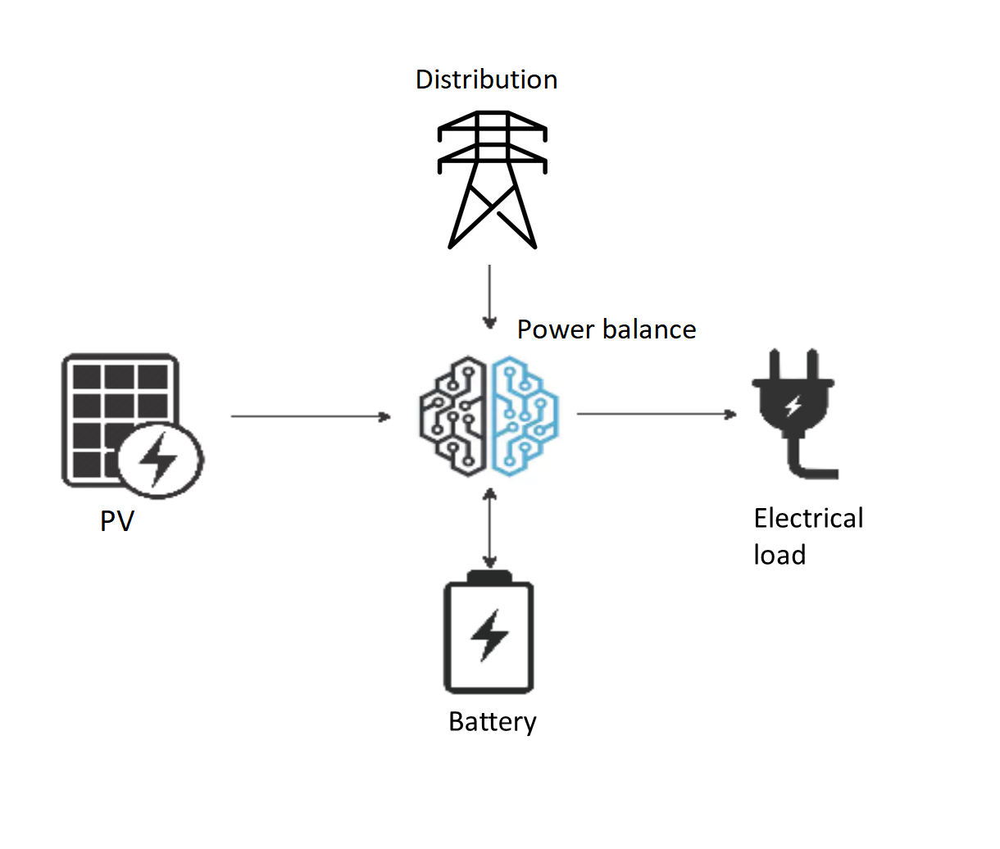

Microgrid
=========

Problem description
~~~~~~~~~~~~~~~~~~~

A grid-connected microgrid is a small-scale and (ideally) self-sufficient electric power system. It consists of an interconnection of electric generators (e.g., solar panels or fossil fuel generators) and loads (the set of electricity consumers). An electrical storage system is often added to the system in order to balance electricity production and consumption in time while limiting the dependence on the distribution network. The configuration of the microgrid system is shown in :numref:`microgrid`.

	Microgrid system configuration.

In this section, we study the problem of sizing an electric microgrid similar to the one shown in :numref:`microgrid`. The aim of the sizing problem is to determine the amount of solar panel and battery storage capacity required to minimize the cost of serving pre-specified electricity demand levels over the lifetime of the system. Hence, both investment and operating costs are taken into account. In addition, the electricity consumed in the microgrid and the solar irradiation of the panels are assumed known for a typical representative day.

GBOML implementation
~~~~~~~~~~~~~~~~~~~~

The system is composed of four nodes implementing the behavior of the elements of the microgrid. The first node corresponds to solar panels. The second node represents the dynamics and costs of a battery based on the power flows that charge and discharge it. The third node models the consumer load. The last node represents the electricity distribution network. The power balance of the system is represented via a hyperedge. A skeleton of the optimization problem expressed in the language is provided below. First, the horizon :math:`T` is defined as the number of hours over the lifetime of the system, which is assumed to be twenty years. Then, the four nodes are implemented. Finally, these nodes are linked via a hyperedge.

.. code-block::

	#TIMEHORIZON
	T = 20 * 365 * 24; // number of hours in twenty years

	#NODE SOLAR_PV
	// Implementation of solar panel node

	#NODE BATTERY
	// Implementation of battery node

	#NODE DEMAND
	// Implementation of demand node

	#NODE DISTRIBUTION
	// Implementation of distribution network node

	#HYPEREDGE POWER_BALANCE
	// Implementation of power balance hyperedge

Let us now discuss the implementation of the four nodes one by one. In what follows, Latin letters denote optimization variables, while Greek letters are used for parameters.

A solar panel is a technology that harnesses solar radiation for electricity production. The installed capacity of solars panels :math:`\bar{P}^{PV} \in \mathbb{R}^+` (in watt) determines the maximum amount of power that they may produce at any point in time. The investment cost :math:`I^{PV} \in \mathbb{R}^+` (in some currency) can be calculated as the product of the installed capacity and the capital expenditure (CAPEX) :math:`\iota^{PV} \in \mathbb{R}_+` associated with the deployment of one unit of capacity (in currency/watt):

.. math::

	I^{PV} = \iota^{PV} \cdot \bar{P}^{PV}.

At time :math:`t`, the maximum power that may be generated by the solar panels is equal to the product of the installed capacity :math:`\bar{P}^{PV}` and a dimensionless capacity factor parameter :math:`\pi^{PV}_t \in \left[ 0, 1\right]`, which is computed based on the irradiance at time :math:`t` and the PV technology at hand. In addition, the power can be curtailed so that the actual power production :math:`p^{PV}_t \in \mathbb{R^{+}}` (in watt) can be smaller than the maximum power that may be generated by the panels. The latter is captured by the following inequality constraint involving the power injected into the microgrid and the maximal power generated by the solar panels, the constraint being tight when no curtailment occurs:

.. math::

	p^{PV}_t \leq \pi^{PV}_t \cdot \bar{P}^{PV}, \; t = 0, \ldots, T-1.

The node describing the solar panels is implemented below. This node has two scalar internal variables: one for the capacity :math:`\bar{P}^{PV}` and one for the investment cost :math:`I^{PV}`. A time-dependent external variable implements the power generated by the panels :math:`p^{PV}_t`. Constraints are used to define the investment cost and the power output of the solar panels and enforce the nonnegativity of optimization variables. Finally, the objective to be minimized is the investment cost :math:`I^{PV}`.

.. code-block:: c

	#NODE SOLAR_PV
	#PARAMETERS
	capex = 600; // capital expenditure per unit capacity
	capacity_factor = import "pv_gen.csv";
	#VARIABLES
	internal: capacity;
	internal: investment_cost;
	external: electricity[T];
	#CONSTRAINTS
	capacity >= 0;
	electricity[t] >= 0;
	electricity[t] <= capacity_factor[mod(t, 24)] * capacity;
	investment_cost == capex * capacity;
	#OBJECTIVES
	min: investment_cost;

A battery is an electrical device that can store energy. The installed capacity :math:`\bar{E}^B \in \mathbb{R}^+` (in watt-hour) defines the maximum amount of energy that may be stored in the battery. Similarly to the solar panels, a capital expenditure :math:`\iota^B` (in currency/watt-hour) is associated with the deployment of one unit of battery storage capacity, such that the investment cost :math:`I^{PV} \in \mathbb{R}^+` is computed as follows:

.. math::

	I^{B} = \iota^{B} \cdot \bar{E}^{B}.

Energy can be charged or discharged from the battery by letting power flow in or out of the battery. The charging power and discharging power are denoted by :math:`p^{B+}_t \in \mathbb{R}^+` (in watt) and :math:`p^{B-}_t \in \mathbb{R}^+` (in watt), respectively. The energy stored in the battery :math:`e^{B}_t \in \mathbb{R}^+` (in watt-hour), which is sometimes referred to as the *state of charge* of the battery, is upper-bounded by the installed capacity:

.. math::

	e^{B}_t \leq \bar{E}^{B}, \; t = 0, \ldots, T-1.

In addition, the state of charge is linked to the power flowing in and out of the battery through the following constraint:

.. math::

	e^{B}_{t+1} = e^{B}_t + \eta \cdot p^{B+}_t - \frac{p^{B-}_t}{\eta}, \; t = 0, \ldots, T-2,

where :math:`\eta \in \left[0, 1\right]` is the efficiency of the battery, which is a parameter quantifying the energy lost when charging and discharging the battery. Finally, it is common to impose that the energy stored in the battery at the beginning of the time horizon is equal to the energy stored in the battery at the end of it, in order to avoid spurious transient effects in storage operation close to the beginning and the end of the time horizon:

.. math::

	e^{B}_{0} = e^{B}_{T-1}.

In addition to two scalar internal variables representing the installed capacity :math:`\bar{E}^{B}` and the investment cost :math:`I^{B}`, a time-dependent internal variable is used for the energy stored in the battery :math:`e^{B}_t`. Furthermore, the charge :math:`p^{B+}_t` and discharge :math:`p^{B-}_t` power flows are defined as time-dependent external variables of the battery node. Finally, the investment cost :math:`I^{B}` is minimized. The implementation is provided below.

.. code-block:: c

	#NODE BATTERY
	#PARAMETERS
	capex = 150; // capital expenditure per unit capacity
	efficiency = 0.75;
	#VARIABLES
	internal: capacity;
	internal: investment_cost;
	internal: energy[T];
	external: charge[T];
	external: discharge[T];
	#CONSTRAINTS
	capacity >= 0;
	energy[t] >= 0;
	charge[t] >= 0;
	discharge[t] >= 0;
	energy[t] <= capacity;
	energy[t+1] == energy[t] + efficiency * charge[t] - discharge[t] / efficiency;
	energy[0] == energy[T-1];
	investment_cost == capex * capacity;
	#OBJECTIVES
	min: investment_cost;

In the demand node shown below, the electrical consumption :math:`p^{C}_t \in \mathbb{R}^+` (in watt) is computed for each time :math:`t` based on a time series provided as a parameter and giving the typical consumption for the 24 hours of a representative day. No objective is required.

.. code-block:: c

	#NODE DEMAND
	#PARAMETERS
	demand = import "demand.csv";
	#VARIABLES
	external: consumption[T];
	#CONSTRAINTS
	consumption[t] == demand[mod(t, 24)];

The distribution node represents the distribution network to which the microgrid is connected. It is possible to buy power :math:`p^{D}_t \in \mathbb{R}^+` (in watt) from the grid to make up for any power shortage that may occur in the microgrid at time :math:`t`. This power is bought at a marginal price :math:`\theta^{D}` (in currency/watt) such that the operating cost :math:`o_t^D \in \mathbb{R}_+` at time :math:`t` is given by:

.. math::

	o_t^D =  \theta^{D} \cdot p^{D}_t, \; t = 0, \ldots, T-1.

In this node, the total operating cost :math:`O^D \in \mathbb{R}_+` over the lifetime of the system is minimized, and the objective function is thus the following:

.. math::

	O^D = \sum_{t=0}^{T-1} o_t^D.

This node is implemented below. The imported power :math:`p^{D}_t` is modeled by a time-dependent external variable. Moreover, the operating cost :math:`o_t^D` is computed using a time-dependent internal variable and the total operating cost :math:`O^D` is minimized.

.. code-block:: c

	#NODE DISTRIBUTION
	#PARAMETERS
	electricity_price = 0.05;
	#VARIABLES
	internal: operating_cost[T];
	external: power_import[T];
	#CONSTRAINTS
	power_import[t] >= 0;
	operating_cost[t] == electricity_price * power_import[t];
	#OBJECTIVES
	min: operating_cost[t];

All nodes are connected via a hyperedge implementing an equality constraint that represents the balance between electricity production and consumption in the microgrid. Hence, the sum of the solar production :math:`p^{PV}_t`, the power discharged from the battery :math:`p^{B-}_t` and the power bought from the distribution network :math:`p^{D}_t` must be equal to the sum of the power charged in the battery :math:`p^{B+}_t` and the power consumed :math:`p^{C}_t` by loads and appliances. In other words, the following constraint enforces the power balance in the microgrid:

.. math::

	p^{PV}_t + p^{B-}_t + p^{D}_t = p^{B+}_t + p^{C}_t, \; t = 0, \ldots, T-1.

This hyperedge can be implemented  as follows:

.. code-block:: c

	#HYPEREDGE POWER_BALANCE
	#CONSTRAINTS
	SOLAR_PV.electricity[t] + BATTERY.discharge[t] + DISTRIBUTION.power_import[t] == BATTERY.charge[t] + DEMAND.consumption[t];

Finally, the complete model is obtained by substituting the code blocks of all nodes in the skeleton code introduced earlier. The model is then translated using the GBOML compiler and solved with Gurobi. For the optimal configuration, the objective function is such that:

.. math::

	\min \underset{\text{Investment PV}}{\underbrace{\iota^{PV} \cdot \bar{P}^{PV}}} + \underset{\text{Investment battery}}{\underbrace{\iota^B \cdot \bar{E}^{B}}} + \underset{\text{Power Imports}}{\underbrace{\sum_{t=0}^{T-1} \theta^D \cdot p^{D}_t}} \approx 5.6 \times 10^4.

How to run the example
~~~~~~~~~~~~~~~~~~~~~~

There are two ways of running the microgrid example:

* From the command line: first, you need to go to the GBOML directory, open a terminal window and type the following commands,

.. code-block:: c

	gboml examples/microgrid/microgrid.txt --cplex --json --output microgrid_example

This will solve the microgrid problem using CPLEX and save the solution in "examples/microgrid/microgrid_example.json".

* From Python: execute the following Python code,

.. code-block:: python

    from gboml_script import GbomlGraph

    gboml_model = GbomlGraph(24*365)
    nodes, edges = gboml_model.import_all_nodes_and_edges("path_to_GBOML_directory/examples/microgrid/microgrid.txt")
    gboml_model.add_nodes_in_model(*nodes)
    gboml_model.add_hyperedges_in_model(*edges)
    gboml_model.build_model()
    solution = gboml_model.solve_cplex()
    print(solution)

The solution of this example is printed in the terminal.
