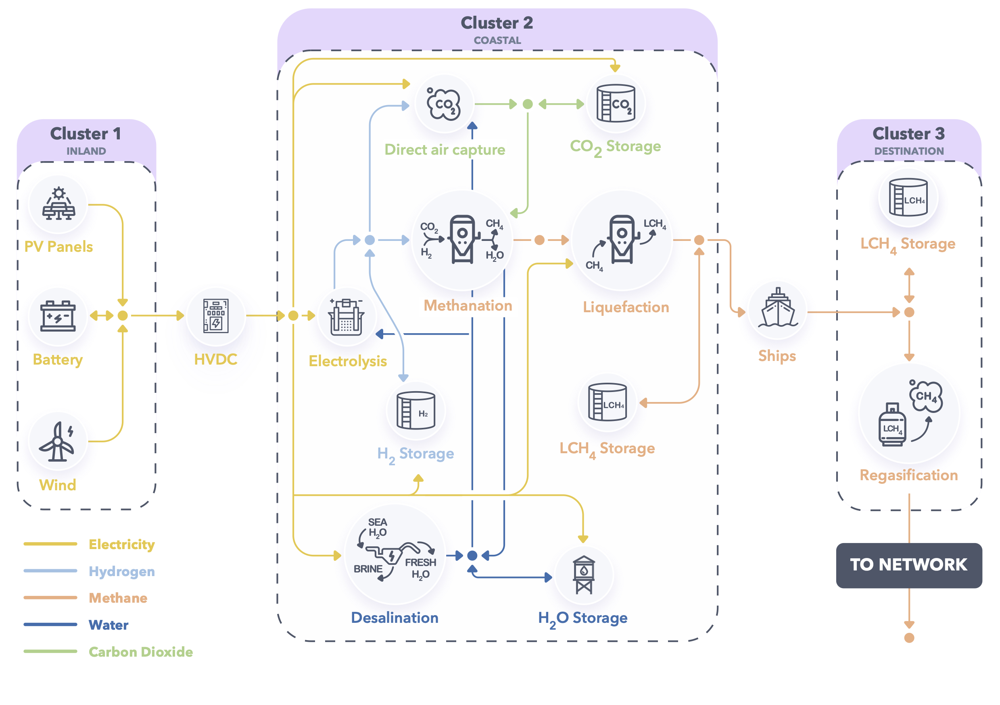

Remote Hub Example
==================

Problem description
~~~~~~~~~~~~~~~~~~~

The production of carbon-neutral synthetic fuels in remote areas where high-quality renewable resources are abundant has long been viewed as a means of developing a cost-effective, decarbonised energy supply for countries with limited local renewable potential (see for instance `Hashimoto et al. <https://www.sciencedirect.com/science/article/pii/S0921509399000921?via%3Dihub>`_). The synthesis of carbon-neutral fuels relies on a set of tightly-integrated technologies implementing various chemical processes. In order to properly estimate the cost of the final product, the entire supply chain must be modelled in an integrated fashion, from remote electricity production to product delivery at the destination.

From a modeling perspective, remote carbon-neutral fuel supply chains can be naturally represented as hypergraphs where each node models a technology or process and has a low degree (i.e., each technology only interacts with a small subset of all technologies and processes), as depicted below for the particular case of synthetic methane. Moreover, for the purpose of strategic techno-economic analyses, each process can be described using one of only two simple generic nodes, namely *conversion* and *storage* nodes. Roughly speaking, conversion nodes represent technologies implementing physical processes that enable the transformation of commodities, while storage nodes model technologies that can hold commodities over time and restore them when needed. On the other hand, the relationship between nodes is expressed via so-called *conservation* hyperedges that enforce the conservation of flows of commodities between conversion and storage nodes. These nodes and hyperedges are simple to encode in GBOML, which therefore provides a convenient way of building integrated carbon-neutral fuel supply chain models.

The modeling framework was leveraged in `a recent paper <https://www.frontiersin.org/articles/10.3389/fenrg.2021.671279/full>`_ to study the economics of producing carbon-neutral synthetic methane from solar and wind energy in North Africa and exporting it to Northwestern Europe. The supply chain schematically represented in :numref:`remote_hub` was modelled in an integrated fashion, and each technology in the supply chain was sized based on an operational horizon of five years with hourly resolution in order to minimize total system cost. The full supply chain model is described in detail in the paper, along with the data required to instantiate it. Results suggest that total system costs would be around 1.5 BEUR/year (over the lifetime of the system) by 2030 for systems producing 10 TWh (higher heating value) of synthetic methane annually using a combination of solar and wind power plants (assuming a weighted average cost of capital of 7%), respectively, resulting in carbon-neutral synthetic methane costs around 150 EUR/MWh. A comprehensive sensitivity analysis is also carried out in order to assess the impact of various techno-economic parameters and assumptions on synthetic methane cost, including the availability of wind power plants, the investment costs of electrolysis, methanation and direct air capture plants, their operational flexibility, the energy consumption of direct air capture plants, and financing costs. The most expensive configuration (around 200 EUR/MWh) relies on solar photovoltaic power plants alone, while the cheapest configuration (around 88 EUR/MWh) makes use of a combination of solar PV and wind power plants and is obtained when financing costs are set to zero. The input files encoding the model in GBOML and enabling the replication of these results are available in the `GBOML repository <https://gitlab.uliege.be/smart_grids/public/gboml>`_.

	Remote hub system configuration.

How to run the example
~~~~~~~~~~~~~~~~~~~~~~

There are two ways of running the remote hub example:

* From the command line: first, you need to go to the GBOML directory, open a terminal and write the following,

.. code-block:: bash

	python main.py examples/remote_energy_supply_chain/remote_hub_nowacc.txt --cplex --json -o remote_hub_example

This will solve the remote hub problem using CPLEX and save the solution in "examples/remote_energy_supply_chain/remote_hub_example.json".

* From Python: execute the following Python code,

.. code-block:: python

    from gboml_script import GbomlGraph

    gboml_model = GbomlGraph(24*365)
    nodes, edges = gboml_model.import_all_nodes_and_edges("path_to_GBOML_directory/examples/remote_energy_supply_chain/remote_hub_nowacc.txt")
    gboml_model.add_nodes_in_model(*nodes)
    gboml_model.add_hyperedges_in_model(*edges)
    gboml_model.build_model()
    solution = gboml_model.solve_cplex()
    print(solution)

The solution of this example is printed in the terminal.
